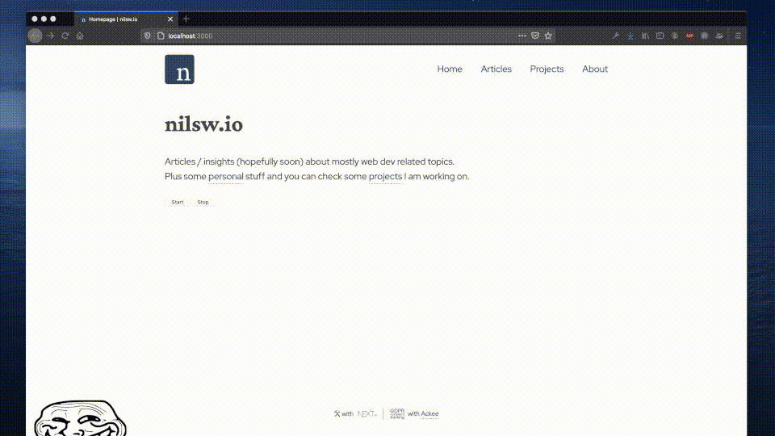

# trollface.js

  

Brings the :trollface: to your website!

## Usage

Either do it the oldschool way `` or import it in your app via `import 'trollfacejs'`.

Call `[window.]trollfacejs.start()` to display that sexy tollface and `[window.]trollfacejs.stop()` to hide again.

Lots of fun incoming!
